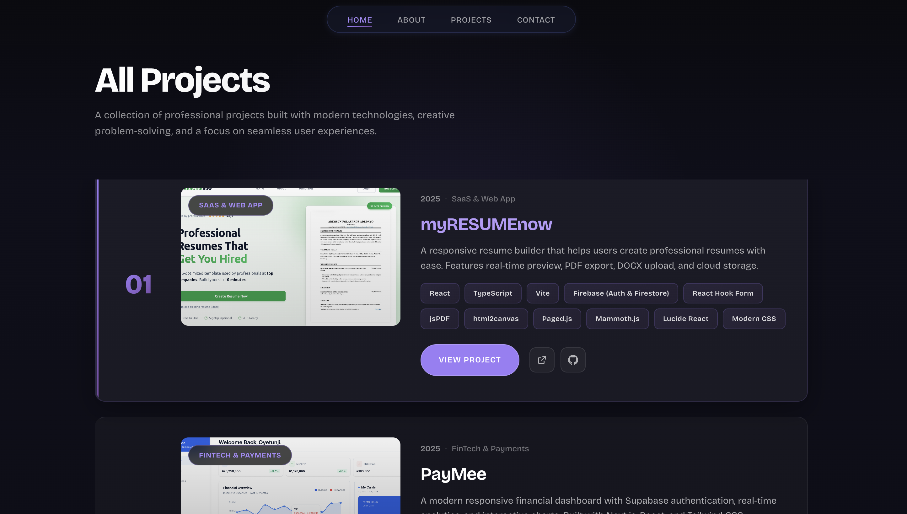
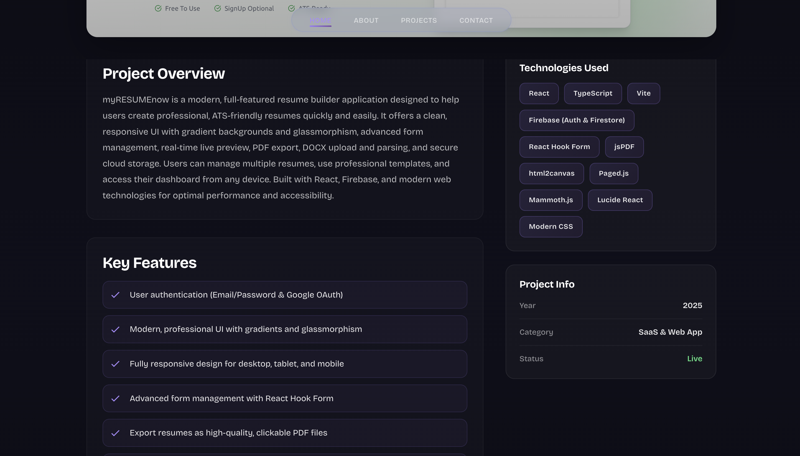
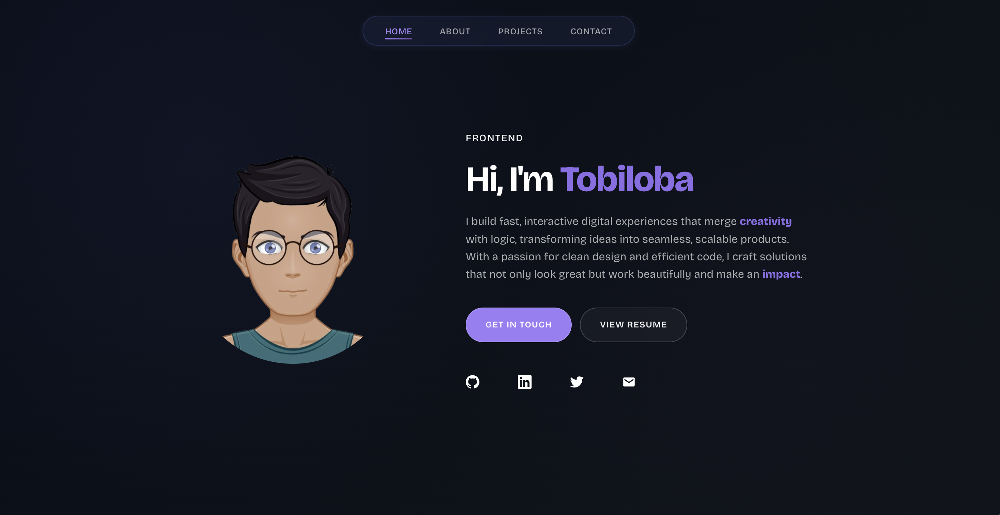
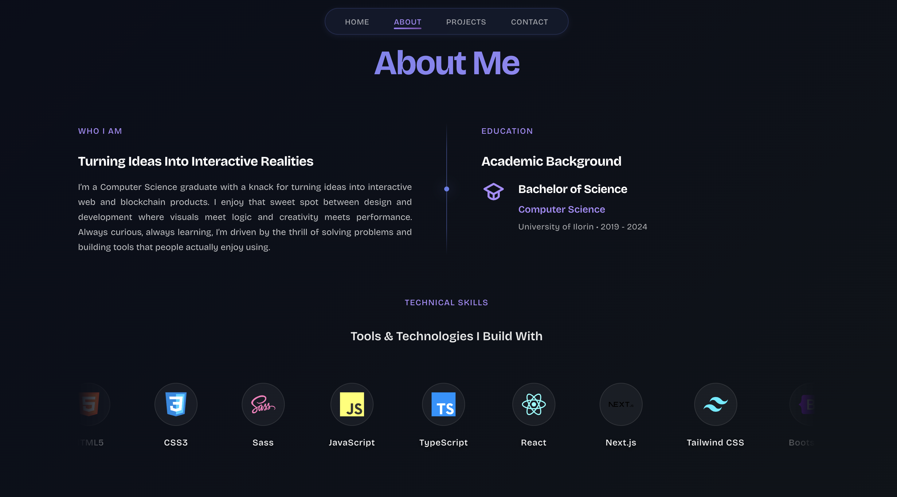
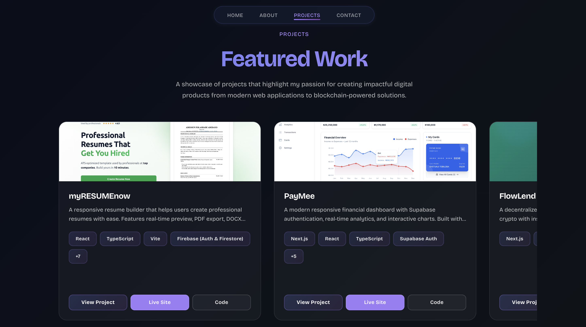
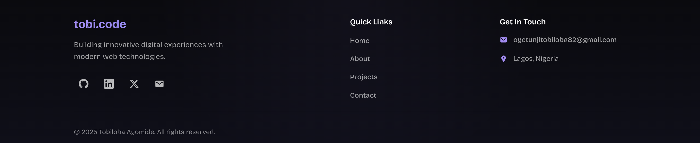

# Tobiloba Ayomide – Logic Behind My Portfolio

For a long time, I wanted to refine my portfolio and make it truly mine. I finally took the courage to start, and this is the story of how I rebuilt it.

---


## 1. Breaking It All Down

I started by cloning my old portfolio ([see it here](https://hunkymanie.vercel.app)) and decided the first thing to do was break the big `App.tsx` into smaller, reusable components. I wanted each section to be easy to work on and update.



---


## 2. The Navbar

I began with the navbar. My goal was minimalism, so I ditched my old logo and went for a clean, glassmorphic look. The result is a simple, modern navbar that blends into the background and keeps the focus on the content.

---


## 3. The Loading Effect

Next, I wanted a little polish when the site loads. I added a loading screen that appears for 2 seconds before the main site shows up. This gives a smooth first impression and a bit of personality.



---


## 4. The Hero Section

For the hero, I wanted something more personal. I used Cartonize to create a cartoon avatar of myself and added it to the hero section. To make it more dynamic, I added a typing effect for my role.



Here’s a snippet of the code I used for the typing effect:

```js
const roles = [
   'Frontend Developer',
   'Blockchain Developer',
   'Web3 Enthusiast'
];

useEffect(() => {
   const typingSpeed = isDeleting ? 50 : 100;
   const pauseTime = 2000;

   const timer = setTimeout(() => {
      const fullRole = roles[roleIndex];
      if (!isDeleting) {
         if (currentRole.length < fullRole.length) {
            setCurrentRole(fullRole.substring(0, currentRole.length + 1));
         } else {
            setTimeout(() => setIsDeleting(true), pauseTime);
         }
      } else {
         if (currentRole.length > 0) {
            setCurrentRole(fullRole.substring(0, currentRole.length - 1));
         } else {
            setIsDeleting(false);
            setRoleIndex((prev) => (prev + 1) % roles.length);
         }
      }
   }, typingSpeed);

   return () => clearTimeout(timer);
}, [currentRole, isDeleting, roleIndex]);
```

---


## 5. The Hero & About Section

After the hero, I wanted to give visitors a quick summary of who I am, so I added a short profile and my education details right on the page.



For my technical skills, I wanted something more lively than a static list. I built an automatic scrolling carousel of all the tech logos I use. Here’s a simplified version of the JavaScript for the infinite scrolling effect:

```js
// Duplicate the skills array to create a seamless loop
const duplicatedSkills = [...skills, ...skills];

// In the JSX:
<div className="skills-carousel">
   <div className="skills-track">
      {duplicatedSkills.map((skill, index) => (
         <div key={index} className="skill-card">
            
            <span>{skill.name}</span>
         </div>
      ))}
   </div>
</div>
```

The CSS handles the animation, making the logos scroll smoothly across the screen.

---


## 6. Projects Section & Details

For my projects, I wanted something interactive and visually appealing. I used a card layout for each project, and just like my skills section, the projects also scroll automatically in a carousel. When you hover on a card, it reveals the category of the project—whether it’s SaaS, eCommerce, FinTech, or something else.



At the bottom, I added a “View all projects” button that leads to a dedicated page ([see it live](https://tobicode.netlify.app/projects)) showing every project in detail.

Each project card also has a “View Project” button. Clicking it takes you to a single project details page.

### How I Made It Modular

Instead of creating a separate page for every project, I made a single, styled Project Details page. I store all my project info in a single file, `projectsData.ts`, and use the project’s ID to fetch the right data.

#### Here’s a simplified version of how I store the data:

```ts
// src/data/projectsData.ts
export interface Project {
   id: number;
   title: string;
   category: string;
   description: string;
   image: string;
   technologies: string[];
   liveUrl: string;
   githubUrl: string;
}

export const projectsData: Project[] = [
   {
      id: 1,
      title: 'myRESUMEnow',
      category: 'SaaS',
      description: 'A resume builder with real-time preview and PDF export.',
      image: '/assets/myRESUMEnow.png',
      technologies: ['React', 'TypeScript', 'Firebase'],
      liveUrl: 'https://my-resume-now.vercel.app',
      githubUrl: 'https://github.com/tobilobaayomide/myRESUMEnow'
   },
   // ...more projects
];

// Helper to get a project by ID
export const getProjectById = (id: number): Project | undefined =>
   projectsData.find(project => project.id === id);
```

#### And here’s how the Project Details page fetches the data:

```tsx
// src/pages/ProjectDetailsPage.tsx
import { useParams } from 'react-router-dom';
import { getProjectById } from '../data/projectsData';

const ProjectDetailsPage = () => {
   const { id } = useParams();
   const project = getProjectById(Number(id));

   if (!project) return <div>Project not found.</div>;

   return (
      <div>
         <h1>{project.title}</h1>
         
         <p>{project.description}</p>
         {/* ...other details */}
      </div>
   );
};

export default ProjectDetailsPage;
```

This way, adding a new project is as simple as updating one file, and the details page just works!

---


## 7. The Footer & Personal Touches

To wrap things up, I gave the footer a more standard and polished look. I integrated quick links for easy navigation, added my contact info, and made sure it fits the overall style of the site.



This project was personal to me, so I went the extra mile: I used the cartoon avatar I created as my favicon, making the branding feel truly mine.

---

## How to run it

```bash
git clone https://github.com/tobilobaayomide/myPortfolio.git
cd myPortfolio
npm install
npm run dev
```

Then open http://localhost:5173 in your browser.

---

## Tech

- React + TypeScript
- Vite
- Custom CSS

---

## Contact

If you want to reach out, just use the contact form or email me: oyetunjitobiloba82@gmail.com

---

Let me know if you want to add anything else!
